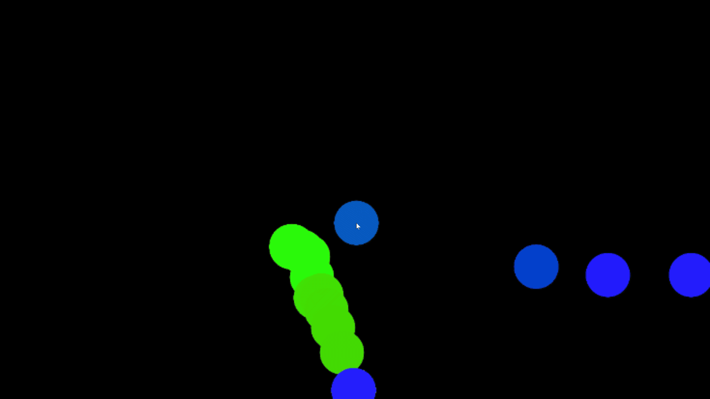
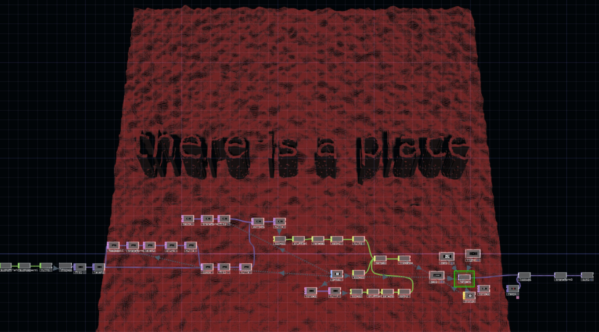

**Orientation Project Documentation**

  

***November***

  

-   Watched many of “Introduction to Touchdesigner” videos on youtube, sometimes it becomes embarrassing that I spend lots of time on trying to find good information, rather than actually learning. In the end the best and up-to date introduction video was the one of the developers of Touchdesigner Ben Voigt (4 hours). [https://www.youtube.com/watch?v=wmM1lCWtn6o](https://www.youtube.com/watch?v=wmM1lCWtn6o)
    

  

-   Finished the book “An Introduction to Touchdesigner” by Nvoid ([https://nvoid.github.io/](https://nvoid.github.io/)) Good adds-on to Ben Voigt’s video. Insight from the book - for the type of visuals I want I need to user GLSL shader, it’s possible to integrate GLSL shaders from Shadertoy, but it’s still a bit tricky. Made my first simulation.

  

-   Started to read “The Book of Shaders” ([https://thebookofshaders.com/](https://thebookofshaders.com/)) to learn more about GLSL Shaders to code my own shader, but gave up at the middle. Insight from the book - shaders are really fun and cool, but for the scope of this project it’s hard to learn them from scratch. The books is really good though, highly recommended!

  

***December***

  

-   Decided to get rid of the idea of using external shaders and work with what I’ve got in Touchdesigner. Started learning from the tutorials by Matthew Ragan, in some way Daniel Shiffman of Touchdesigner
    

  

-   Watched tutorials from Yale Workshop of Matthew Ragan, which he recommends for absolute beginners. Spend the whole day building the web movie player, hoping to learn more about the logic of the program, gave up almost in the end realizing that I’m loosing time and it’s not that much help for my own project [https://matthewragan.com/touchdesigner-workshop-yale-2017/](https://matthewragan.com/touchdesigner-workshop-yale-2017/)
    

  

-   Started his other workshop THP 494 & 598 | Generative Media for Live Performance [https://matthewragan.com/teaching-resources/touchdesigner/thp-494-598-generative-media-for-live-performance/](https://matthewragan.com/teaching-resources/touchdesigner/thp-494-598-generative-media-for-live-performance/), which turned out to be better. Learned about Instancing, Noise CHOP, Feedback, Realtime Rendering networks, The Composite TOP. In the end made my first scene, using mostly noise CHOPs. Quite satisfied with it, taking into account that my reference images from Rafik Anadol were similar.
    
   
    
  
    (Rafik Anadol, Latent Being, https://www.lightartspace.org/events/latent-being)

  

***January***

  

-   Started working on interaction. It turned out to be not so easy as I thought. Either I’m so stupid, or it’s actually not so well made in Touchdesiger as in Processing. All the information I could find was about mapping the object to the Mouse (using Mouse In Chop, then connecting it to the Select CHOP to select tx and ty chanells for mouse positions) https://www.youtube.com/watch?v=VfA0IxwII84, but it’s not what I need - what I’m looking for is to be able mouse-click on the different areas of the container to make text appear in that areas and I can't find information on mouse-clicking!! In the end of the research was able to start my first simulation using Keyboard In CHOP with pressing key 1 on keyboard. At least some sort of the interaction.
    
 
    
-   After Pitch and Peer review and talking to Valeria I realized that I can go to Touchdesighner Meetup in Berlin to get help from the community. I’ve been already once when I didn’t have any project and completely forgot about this opportunity. I’m gonna go there on January 30th at 19:30 and ask for help! :) [https://www.meetup.com/ru-RU/TouchDesigner-Meetup-Berlin/events/](https://www.meetup.com/ru-RU/TouchDesigner-Meetup-Berlin/events/)
    
- The Touchdesigner summit was interesting but not that helpful. There were lots of guys and only few girls and I don't know why but I felt uncomfortable. The founders of Deverative were there and gave a presenation on history of Touchdesigner so there was not that much opportunity to ask questions. In the end I asked people about how to integrate text into my noise visuals in a nicer way, I got some tips and also got introduced to amimation timiline, but left the meetup still feeling confused. 

***February***

Finally understood how mouse click interaction works in touchdesigner. It turned out that you need to use Panel Chop or Button Comp. I used the later, with selecting the width and height of the window with Select CHOP, mapping it to tx and ty with Math CHOP as well as select right mouse click and use it to trigger the event. It turned out to be so easy, but I spent so much time on finding information that now I regret, I should have just started with Kinect gesture interaction. 

Got Leap Motion from Rita and decided to test since I don’t have Kinect yet. It turned out to be much more easier to learn than simple mouse click because the documentation is better. Following the same procedure with Select CHOP did this test with drawing on a screen, where you can clear with a swipe and change the size of the brush with rotate. 

Learned about instancing in Touchdesigner, a technique that lets you copy one piece of geometry many times in an efficient way. I  tried to incorporate text into visuals using instancing approach, by dividing a grid into equal cubes and manipulating the z value of the cubes with pieces of text on it. It worked quite well, but there is an optimization problem and it still makes the app to run slower, taking into account that I have three scenes, it might become a problem later, so I still have to find another way to incorporate text. 

 
***March***

learned about feedback loop, which is used to create feedback effects in TOPs. It can give fake motion blur by not clearing the color buffer, can produce amazing 2D trails, blooms, and other time-based visual effects. It took quite a while to understand, but once you get it, the feedback loop becomes so powerful. So I changed the  first scene using feedback with noise, edge, blur, and displace. 

Got kinect from Markus, learned how to connect it with touchdesigner, which was not that difficult - I just had to download Kinect SDK. Markus has version one of kinect, which doesn’t support point cloud, so I had to work with player index and depth data, which was enough in the end. Watched many tutorials on kinect in touchdesigner. The best one turned out to be from CutMod (https://www.youtube.com/watch?v=r-EOtQhdJxg). Played with kinect and did some tests based on the tutorial from Cutmod. 

Learned about particles in touchdesigner. Any point can be used as the basis for the particles in a particle system. A particle system can be created in SOPs by using a Particle SOP, particles will be emitted from the points of the geometry connected to the Particle SOP's first input.  You can set various parameters, then use a Render TOP to render the particle system in a 2d texture. I made my  second scene using particle system, feedback loop and edge again. 

***April***

Since i wasn’t happy with the way I integrated the text into visuals previously, I had to think of the new way. I decided to get rid of the idea of the text to be a part of the visuals, since it would be too heavy for the real-time rendering and would cause FPS drops. After lots of thinking I decided to have a plain text, but covered in the beginning and the reader would to have somehow dig inside and uncover it with a pointlight. Going through documentation of different TOPS I found that Matte Top is the best solution for it. The Matte TOP composites input1 over input2 using the alpha channel of input3 as a matte. So i have visuals with text on it as input 1 and alone visuals as input 2, and then input three is a circle as a mask matte. 

Added third scene using instancing. I already learned about this technique last month when I was trying to integrate text into visuals, so I wanted to use the knowledge that I gained for the third scene. I watched the tutorial by bileam tschepe (https://www.youtube.com/watch?v=_AtAaek3ca4&t=1s) and created something similar by instancing spheres and making them looking like eyes with a Ramp TOP. But i’m still not really satisfied with the results. 

It was really hard to make a decision on how to switch between scenes. My first idea was to switch to the next scene after all words of the current scene would be revealed. That would mean I would have to change how the text integrated into visuals all other again. The other way is to use a set timeline, so scenes change automatically with a specified time. After talking to my friends it seemed like second idea would work better and first approach is not that intuitive and can confuse the audience. There are so many ways in touchdesigner on how to use a timeline and there are so many nuances to consider when it comes to optimization and FPS. There is even a big multi-layer timeline component (https://derivative.ca/community-post/asset/timebase-multi-layer-timeline-component) from the founder of touchdesigner, but it seemed too complex to me. After lots of research I decided to switch between the scenes with a Switch TOP (with blending between the scenes ON, which means all the scenes will be cooked, which is bad for FPS, but couldn't find better solution) and Speed, Logic, Fan and Lag CHOPs. 

Integrated Kinect: used Kinect CHOP to track right hand and left hand position and used it for revealing words and control of the particles. Used Kinect TOP’s player index data for silhouette in the first scene and Kinect TOP’s depth data for hands of the silhouette in the last scene by setting a threshold to a smaller value so only the parts of silhouette that are close to the camera would be visible.  

Decided to make text to be more interesting. Spent so much time and tried many different things, but wasn’t satisfied with the results. It’s hard in real time cause each word needs to cook and then one need to use instances or replicators to not cook the same geometry. Sadly forgot to document all  things that I tried, but there is the example where I was thinking that words would be spread thought the screen randomly and one would have to swipe to put them in the right order.

learned about Bullet Solver in Touchdesigner, which is a real-time physics simulation. Bullet simulation contains bodies, forces and constraints, and produces motion on the bodies. Bodies have physical properties: mass, size, kinetic friction etc. Each body has a collision shape, which determines how it collides with other bodies. In TouchDesigner all bodies are rigid.  A body can be a whole geometry component, a SOP within a Geometry component, or one or more instances of Geometry component. Decided to use the bullet solver for my last scene to make words fall in the end, to emphasize the line of the poem “drop him bone by bone”. I achieved the desired result by having to 4 actors, but still didn’t like the end result and decided to get rid of the idea. 

Since I wasn’t satisfied with 3rd scene and especially how it looked together with a silhouette from kinect with hands in the fog, I decided to change it completely. I llearned about nvdia flow and decided to use it for the last scene, since it would go nicely with kinect fog silluette. NVIDIA Flow is a volumetric fluid based simulation of a burning gas system. You can control the 3 main factors of temperature, fuel, and smoke to create fire and smoke simulations. I got a really nice burning fire from it in the end. 

Did final tuning of all scenes, worked on color correction to make them be in the same style, cleaned up the network and tried to solve the bag of feedback loops going insane when kinect is not detected. 

My friend sent me a few tracks he made for my installation. I chose one that I liked the most. The sound makes such a big difference. Decided not to have a voice over of the poem and have sound instead of it. I think it’s more powerful way to convey emotion. 

Tried out installation in my kitchen because I don’t have enough space in my room and there is no other place I can do it because of corona :(
