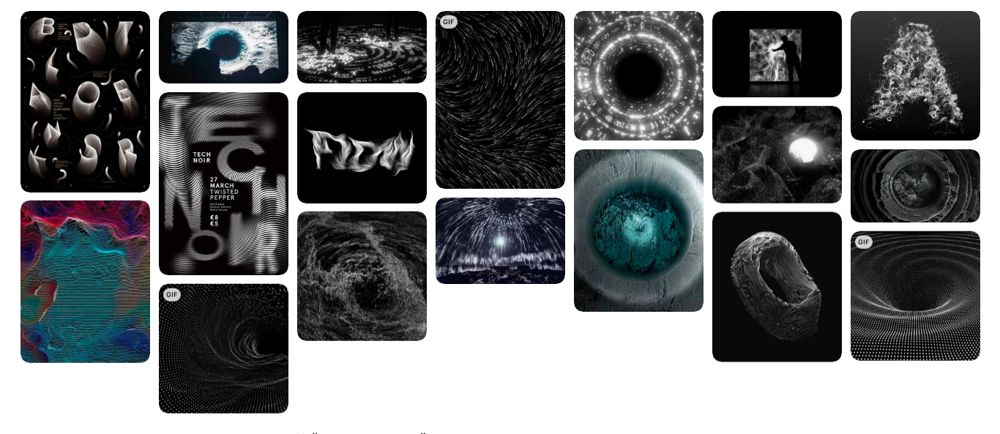

# Link to the video presentation (trailer and demo included):
https://drive.google.com/file/d/1414jKf8V9ONJKpPDKPzACzoMsLOQh9ky/view?usp=sharing

### An interactive abstract visualization of Emily’s Dickinson poem “There is a pain—so utter—”.  

I divided the poem into three themes and highlighted keywords:

/// Theme 1  
There is a **pain**—so utter—   
It **swallows substance up**—  
/// Theme 2    
Then covers the **Abyss with Trance**—  
So **Memory can step**  
Around—across—upon it—  
/// Theme 3   
As one within a **Swoon**—  
**Goes safely**—where **an open eye**—  
**Would drop** Him—**Bone by Bone**.

In this poem, by using imagery and personification, Emily Dickinson conveys the idea about the power of pain - it creates a black hole (an abyss) that takes over the mind. That means the pain is limitless and therefore hard to endure. The line “It swallows substance up--” implies how pain can take control of every part of one’s life.  -- Theme 1 --   
That is why the abyss needs to be covered with trance, like a bandage, where memory can walk safely  (step around - across - upon it) so that pain can be forgotten. For example, when someone dies, person left in grief becomes blind and numb, as if in a trance, and that keeps him safe. --Theme 2 --  
In a Swoon, one can still exist and not be destroyed by grief, but as soon as one gets out of trance (opens eyes), he slowly falls back into the abyss of pain, bone by bone.  --Theme 3 --

Each theme would be represented by different generative abstract animations. The animations would be made in Touchdesigner.  The text of the poem will be integrated into the animation and have the same stylistic approach. In a best case scenario, the animation would be presented in room as projection on the wall and viewer will be able to reveal the text of the poem by hand gestures. It would be also possible to listen to the poem in headphones next to the projection. 

## Moodboard

## The worst case
* polished, visually pleasing visualization
* visualization is generative (particles simulation with Touchdesigner software)
* 2 recognizable themes are represented by 2 scenes (pain, which swallows substance; Abyss with Trance, where memory steps in)
* viewer can interact with visualization by moving the mouse 
* text of the poem is integrated into the visualization 
* viewer can listen to the recorded poem reading 

## The best case

* project is presented as a projection in a room 
* viewer reveals words of the poem with hand gestures
* viewer can still listen to the recorded poem reading in headphones next to the projection
* 3 recognizable themes are represented by 3 scenes (+ open eye, bone by bone)
* smooth transition between scenes after reveal of words for each scene 

## Timetable

November:
* learning about particles simulation in touchdesigner 
* making my first basic simulation
  
December:
* still learning about particles simulation in touchdesigner 
* improving my basic simulation 
  
January:
* hopefully finally understanding how particles in touchdesigner work
* creating first scene
* polishing first scene  
   
February:
* working on the interaction with particles
* testing hand gestures control 
* integrating text
* creating second scene 
  
March:
* recording the poem reading
* setting up projection and checking hand gestures control
* creating third scene 

April: 
* feeling proud that i've done everything in time!
